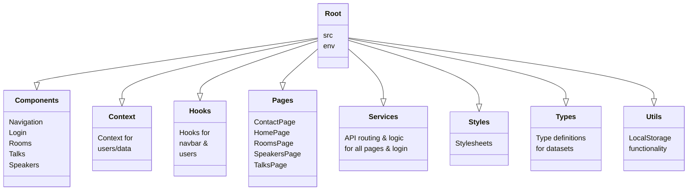

# Project: JavaZone Portal

## Table of Contents
1. [Introduction](#introduction)
2. [Dependencies](#dependencies)
3. [Project Structure](#project-structure)
4. [Setup and Installation](#setup-and-installation)
5. [Configuration](#configuration)
6. [Running The Application](#running-the-application)
7. [Features and Functionality](#features-and-functionality)
8. [API Documentation](#api-documentation)

---

## Introduction
This project is created for a group assignment in our Javascript Frameworks, using `React` and `TypeScript`.

We have created a mock webpage for JavaZone which allows end users to see scheduled talks, what rooms they are in and which speaker is hosting the talk.

Admin functionality allows admin users to add specific rooms, speakers or talks and modify them accordingly.

---

## Dependencies

- **Frontend**: 
  - `React (18.3.1)`
  - `react-router-dom (6.27.0)`
  - `react-icons (5.3.0)`
  - `@icons-pack/react-simple-icons (10.1.0)`
- **Backend**: 
  - `Express (4.21.1)`
  - `bcryptjs (2.4.3)`
  - `jsonwebtoken (9.0.2)`
  - `cookie-parser (1.4.7)`
  - `cors (2.8.5)`
- **Other**:
  - `dotenv (16.4.5)`
  - `concurrently (9.0.1)`
  
---

## Project Structure

---

## Setup and Installation

1. Clone the repository: `git clone https://github.com/oddzor/Arbeidskrav-2---Javascript-Rammeverk`
2. Navigate to the project directory: `cd [your-project-directory]`
3. Install dependencies: `npm install`
4. <em>**[Set up environment variables](#configuration) in a `.env` file.**</em>
5. Start the development server: `npm run dev`

---

## Configuration
  
> [!CAUTION]  
> Failing to create an .env-file in your root directory and using these keys will not allow app to run as intended.

> [!IMPORTANT]  
> **Due to possible issues at [crudcrud](https://www.crudcrud.com/) hosting, ensure that you have accepted HTTPS Not Secure Error before trying to run app**
  
- **REACT_APP_CRUDCRUD_ENDPOINT**: URL for CRUD API endpoint.
- **JWT_SECRET_TOKEN**: Secret token for JWT authentication. (random 64-bit hex code used)
- **PORT**: Port number for the backend server.
- **ADMIN_USERNAME**: Admin username.
- **ADMIN_PASSWORD**: Admin password.

---

## Running the application.
To run the app, provided you have `concurrently` installed, simply input `npm run dev` as this is defined in the concurrently config to run both ends of the application simultaneously.

If not installed, use commands below.
- **Frontend**: Run `npm start` to launch the frontend on `http://localhost:5173`.
- **Backend**: Run `node userauthorization.js` to start the Express server.

---

## Features and Functionality
 ### Authentication
 - User registration and login functionality.
 - Admin-specific access for modifying or deleting content.
 - JWT-based authentication with cookie storage for tokens.
 - Hashing of user passwords using `bcryptjs`

### Speaker Management
 - End users can view a list of speakers with details about the speaker.
 - Registered users that are logged in can create speakers
 - Admin can add, modify, or delete speakers.

### Room Management
 - End users can view a list of rooms and their capacities.
 - Admin can add, modify, or delete rooms.

### Talks
 - End users can view a list of talks.
 - Admin can add, modify or delete talks.

### Homepage

 - Displays information about the rooms, and what talks are expected to be in them.

### Account Menu

 - Dropdown menu for user registration and login, maintains state throughout pages.

---

## API Documentation
### Endpoints

- Related endpoints are as required from assignment, token-authentication and admin-related are routed via `express`, normal user registration and rooms/speakers and talks data are routed through crudcrud.

#### Authentication
- **POST** `/register`: Registers a new user.
- **POST** `/login`: Logs in a user.
- **POST** `/admin/login`: Logs in an admin. isAdmin flag stored in token)
- **POST** `/logout`: Logs out the current user. (Clears token)
- **GET** `/verify-token`: Verifies the JWT token and returns user information (For isAdmin functionality).

#### Speaker Management
- **GET** `/speakers`: Fetches all speakers.
- **POST** `/speakers`: Adds a new speaker (isAdmin only).
- **PUT** `/speakers/:id`: Updates a speaker's information (isAdmin only).
- **DELETE** `/speakers/:id`: Deletes a speaker (isAdmin only).

#### Room Management
- **GET** `/rooms`: Fetches all rooms.
- **POST** `/rooms`: Adds a new room (isAdmin only).
- **PUT** `/rooms/:id`: Updates a room's information (isAdmin only).
- **DELETE** `/rooms/:id`: Deletes a room (isAdmin only).

#### Talks
- **GET** `/rooms`: Fetches all talks.
- **POST** `/rooms`: Adds a new talk (isAdmin only).
- **PUT** `/rooms/:id`: Updates a talk's information (isAdmin only).
- **DELETE** `/rooms/:id`: Deletes a talk (isAdmin only).

---

<h6 style="text-align:center;">END OF DOCUMENT</h3>
